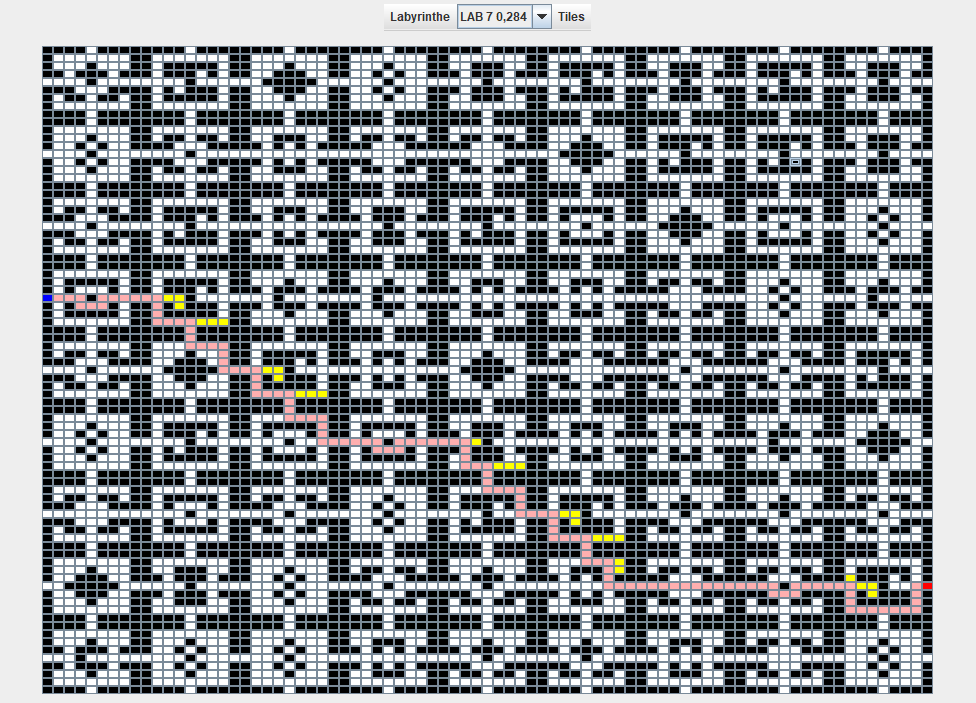

# Algorithmes de recherche : Projet continu :mortar_board:

## Description
### Astar
L'algorithme de recherche Astar utilise les informations connues sur une situation comme par exemple l'entrée et la sortie d'un labyrinthe ainsi qu'une heuristique donnée, par exemple la distance manhatan. En calculant le cout de déplacement et l'heuristique de chaque emplacement visité, Astar nous permet de trouver un chemin optimisé sans visiter trop de positions inutiles.

### Breath first search
L'algorithme de breath first search va priorisé visiter tous ses voisins pour trouver ce qu'il chercher avant de répéter l'opérations pour tous les voisins de tous ses voisins. On peut mimiquer cette description en utilisant une structure de type lilo (last in last out) comme une file pour garder l'ordre de visite des voisins.

### Depth first search
L'algorithme de dept first search va priorisé visiter tous les enfants d'un voisin dans une direction donnée avant de faire de même pour le prochain voisin. On peut mimiquer cette description en utilisant une structure de type fifo (first in first out) comme une pile pour générer l'ordre d'exécution sur les voisins. L'utilisation de la récursion est particulièrement simple pour cet algorithme.

## Aide visuelle
### Représentation visuelle d'une solution par Astar

### Représentation visuelle d'une solution par breath first search

### Représentation visuelle d'une solution par depth first search

## Analyse des algorithmes
### Astar
L'initialisation de l'algorithme se fait en O(n^2)
L'initialisation des valeurs dans les nodes se fait en O(n)
La complexité temporelle de Astar dépend de la qualité de l'heuristique. Je m'explique. Dans le cas ou on doit visiter tous les noeuds parce que l'heuristique est vraiment mauvaise et que les couts sont mal calculés par exemple, la complexité sera de n^2logn parce que on fera n fois les actions de recherches dont l'action la plus longue est le quicksort avec une complexité de nlogn. Par contre, plus on diminue le nombre de noeuds visités plus on s'approche d'une complexité de nlogn.

### Breath first search
La solution se fait en O(n) dans le pire cas ou il faut visiter tous les voisins de tous les voisins pour trouver la sortie.

### Depth first search
La solution se fait en O(n) dans le pire cas ou il faut visiter tous les voisins de tous les voisins pour trouver la sortie.

## Auteurs et reconnaissances
Christopher Desrosiers Mondor

## Licence
CC

## État du projet
Le développement du projet est en attente pour évaluation dans le cadre du cours d'algorithmes.
